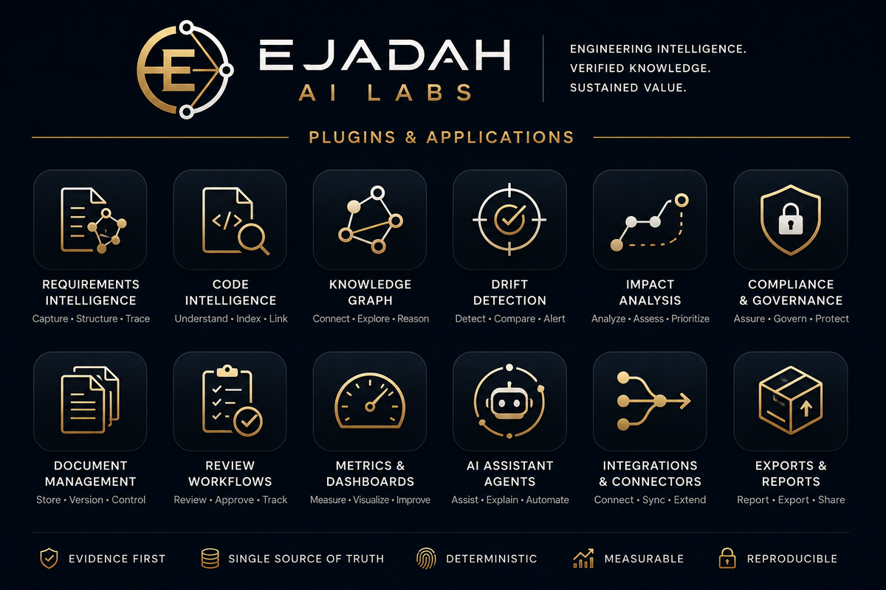

  

<h1 align="center">Sanad — Support</h1>

  <strong>Engineering Intelligence. Verified Knowledge. Sustained Value.</strong>

---

This is the public home for **support, issues and documentation** of
**Sanad — Requirements Engineering Workbench**, by **Ejadah AI Labs**.

The extension's source is proprietary and lives in a private repository. Everything you
need as a *user* is here, and it is public on purpose: you should never need an account,
an invitation, or our permission to report a problem or read the guide.

## Get help

| Need | Where | Target |
|---|---|---|
| Something is wrong | **[Report a bug](../../issues/new?template=bug_report.yml)** | **72 hours** |
| I need a capability | **[Request a feature](../../issues/new?template=feature_request.yml)** | **about one week** |
| How do I…? | **[User Guide](USER_GUIDE.md)** | — |
| Security vulnerability | **[SECURITY.md](SECURITY.md)** — never a public issue | 72 hours to acknowledge |

Those targets mean a **substantive** response — a fix, a workaround, or a clear statement
of what we found and when it lands. Not an automated acknowledgement.

If something is blocking safety-critical work, say so in the first line. It changes our
ordering.

## What makes a report fast to fix

Sanad is an evidence tool, so **a wrong or missing finding is a bug even when nothing
crashed**. The most useful report names the finding you got — or the one you expected and
did not get — the requirement id, and your **template**.

A large share of "this check is missing" reports turn out to be an **undeclared role**.
That is deliberate: a repository declaring no `hazard` role gets no safety findings,
because a confidently wrong number on a safety dashboard is the worst output this product
could produce. [User Guide §4](USER_GUIDE.md) explains how to declare one.

## About Ejadah AI Labs

We are a startup. Our engineering standards, principles and architecture decisions are
published at **[ejadah-foundation](https://github.com/ejadahailabs/ejadah-foundation)** —
including the rules this product is held to.

